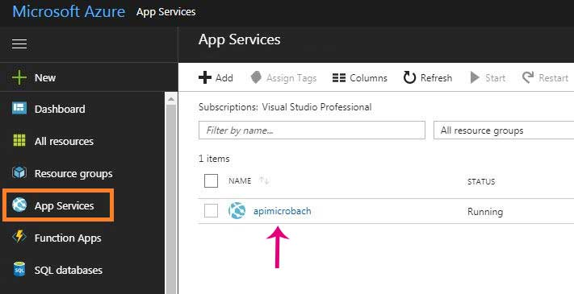
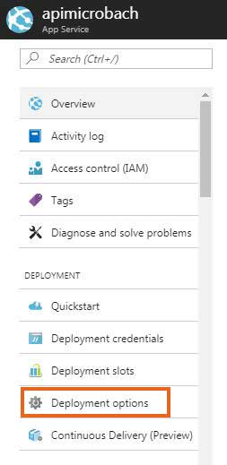
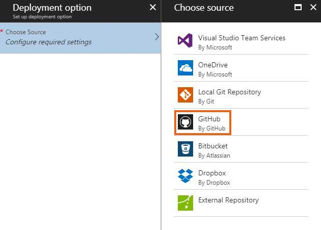
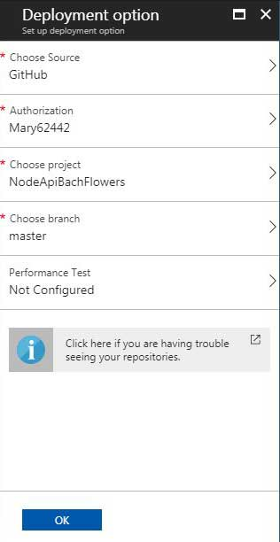
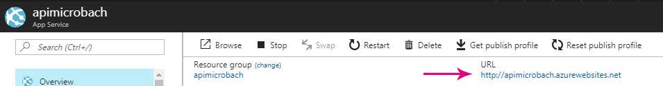
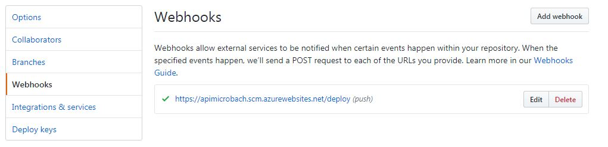

NodeApiBachFlowers
==================

Steps to run this application
-----------------------------

[Download and install node js current version and
npm](https://nodejs.org/en/download/current/)

From inside the folder install node-modules and run app.js

`$ npm init`

`$ node app.js`

Steps to deploy to Azure
------------------------

Create an API on the Azure Portal and select it in App Services

On the services menu in the deployment section click deployment options

Once in the options click choose source and then choose GutHub from the list of
sources

Configure the GitHub profile and the repository needed to deploy to Azure

Once done, test if it’s running by clicking the URL on the Overview page of the
APIS.

GitHub will automatically deploy to Azure and create a webhook showing which
external services are notified when a change in the remote repository is
committed and pushed.

Description of the repository
-----------------------------

This repository contains a series of APIs that post and get data to and from an
mLab based database.

The mongoconfig.js file contains the URI required to connect to the database on
mLab.

Since the client in the FrontEnd is hosted on a different cloud provider than
the API, Cross-Origin Resource Sharing (CORS) must be enabled using the
following function on the server:

`let allowCrossDomain = function (req, res, next) {`

`    res.header('Access-Control-Allow-Origin', '*');`

`    res.header('Access-Control-Allow-Methods', 'GET,PUT,POST,DELETE,OPTIONS');`

`    res.header('Access-Control-Allow-Headers', 'Content-Type, Authorization,
Content-Length, X-Requested-With');`

`    if ('OPTIONS' == req.method) {`

`        res.send(200);`

`    }`

`    else {`

`        next();`

`    }`

`}`

The dependency `body-parser` is required in order to correctly allow the request
to populate the body in the POST method.

There are six APIs: five use the GET method and one uses the POST method. Here
follows the ones that need more attention:

-   The `‘/flowerstatic’ `API is only an example on how to get static data from
    a JSON file.

-   The ‘`/flowers’ `API connects to the BachFlowers collection in the mLab
    based database by requesting connection to the URI specified in the
    mongoconfig.js file. The collection is loaded entirely and then converted to
    array and displayed on the webpage.

-   The `‘/flower’` API gets the flower name provided in the query string and
    returns the flower with the same name found in the collection BachFlowers
    establishing a connection with the database.

-   The `‘/updateflowernotes’` API uses a POST method that requires a request
    body with the name equal to the flower name in the collection and the notes
    to add or update. In this case the API gets data from the database and posts
    new data into it. In order to test the behaviour of the POST method, Postman
    is a useful application.
